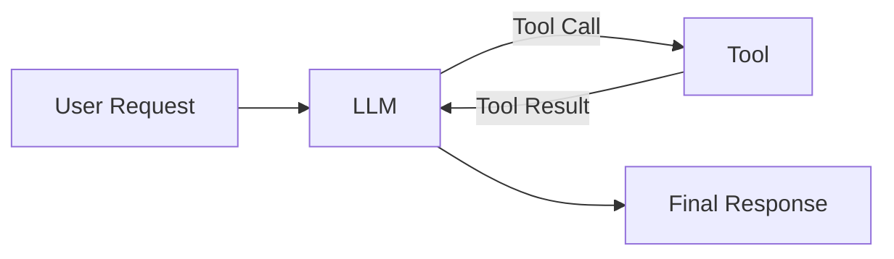
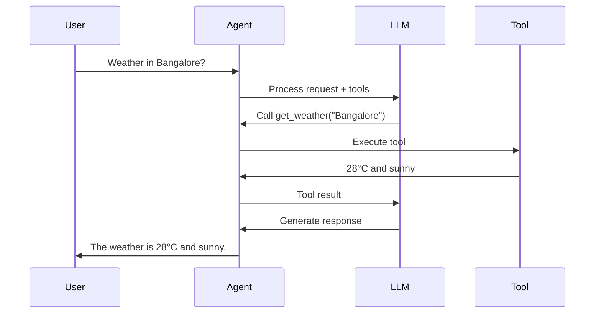

# Creating Custom Agents with LangChain

A custom agent is a workflow where an LLM decides **which tool to use, calls the tool, observes the result, and then produces a final response**.

The basic flow is:



## 1. Define a Tool

LangChain's `@tool` decorator converts a Python function into a tool that the LLM can understand and invoke.

```python
from langchain_core.tools import tool

@tool
def get_weather(city: str) -> str:
    """Get the current weather for a city."""
    return f"The weather in {city} is 28°C and sunny."
```

The function's **name, parameters, and docstring** become part of the tool definition exposed to the LLM.

---

## 2. Create the LLM

```python
from langchain_openai import ChatOpenAI

llm = ChatOpenAI(model="gpt-5.6")
```

---

## 3. Create the Agent

LangChain provides `create_agent()` for creating an agent from an LLM and a set of tools.

```python
from langchain.agents import create_agent

agent = create_agent(
    model=llm,
    tools=[get_weather]
)
```

The agent now has the ability to decide when `get_weather` should be called.

---

## 4. Invoke the Agent

```python
result = agent.invoke({
    "messages": [
        ("user", "What is the weather in Bangalore?")
    ]
})

print(result["messages"][-1].content)
```

Conceptually, the execution is:



## Key Idea

A custom agent consists of three main pieces:

```text
                 ┌──────────────┐
                 │     LLM      │
                 └──────┬───────┘
                        │
              decides which tool
                        │
                 ┌──────▼───────┐
                 │    Tools     │
                 └──────┬───────┘
                        │
                  tool results
                        │
                 ┌──────▼───────┐
                 │ Final Answer │
                 └──────────────┘
```

The important distinction is that **you define the tools and agent configuration, but the LLM decides whether and when to call those tools**.
