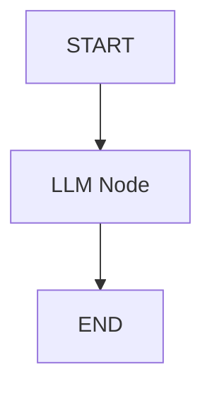
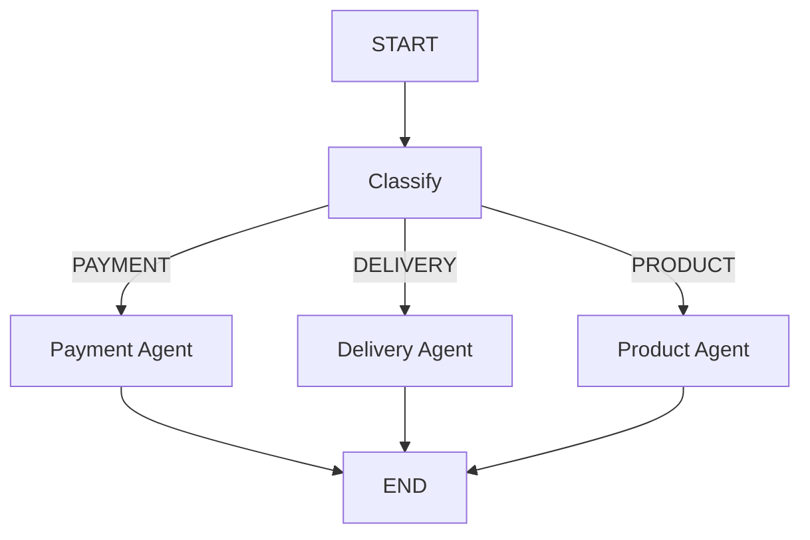
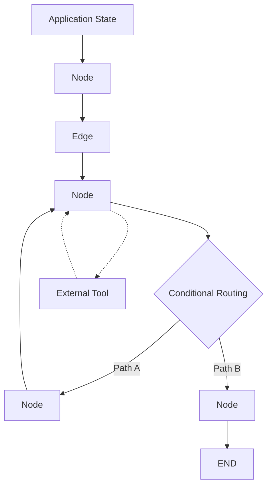

# Part 1 — Introduction to LangGraph

## 1.1 What is LangGraph?

LangGraph allows an application to represent its processing logic as a graph of interconnected nodes.

A simple graph can contain a single LLM:



A more complex application can contain multiple processing paths:



The graph is executable. When the application runs, LangGraph determines which nodes execute and in what order.

---

## 1.2 Core concepts

### State

State contains the information that is carried through the graph.

For example:

```python
class State(TypedDict):
    complaint: str
    category: str
    response: str
```

A state could contain:

```python
{
    "complaint": "I was charged twice for my order.",
    "category": "PAYMENT",
    "response": ""
}
```

As nodes execute, they can read existing state and return updates.

---

### Nodes

A node is a Python function that performs some operation.

For example:

```python
def classify(state: State):

    response = llm.invoke(
        state["complaint"]
    )

    return {
        "category": response.content
    }
```

A node could contain:

* An LLM call
* Python logic
* Tool execution
* Database access
* REST API calls
* Validation
* Agent logic

---

### Edges

An edge connects one node to another.

```python
builder.add_edge(
    "classify",
    "analyze"
)
```

This means that after `classify` completes, `analyze` executes.

---

### Conditional edges

A conditional edge allows the next node to be selected dynamically.

```python
builder.add_conditional_edges(
    "classify",
    route_complaint,
    {
        "payment": "payment",
        "delivery": "delivery",
        "product": "product"
    }
)
```

The routing function determines the destination.

---

### Cycles

A graph can contain a cycle.

```python
builder.add_edge(
    "revise",
    "review"
)
```

This allows a node to execute repeatedly as part of an iterative process.

---

### Tools

Tools provide capabilities outside the LLM itself.

For example:

```python
@tool
def get_order_details(order_id: str):
    ...
```

The LLM can request the tool, the application executes it, and the result can be returned to the LLM.

---

## 1.3 Overall architecture

These concepts work together:



The rest of the examples build on these concepts.

---
