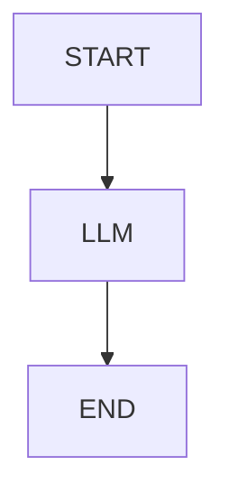
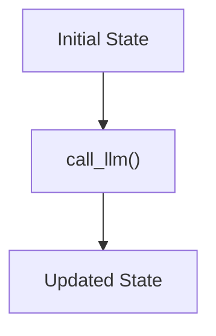

# Part 2 — Example 1: A Single LLM Node

The simplest LangGraph application contains one LLM node.

## 2.1 Architecture



The application receives a question and asks the LLM to generate an answer.

---

## 2.2 Define the state

```python
from typing import TypedDict

class State(TypedDict):
    question: str
    answer: str
```

The state contains:

```text
question
answer
```

---

## 2.3 Create the LLM

```python
from langchain_openai import ChatOpenAI

llm = ChatOpenAI(
    model="gpt-4o-mini",
    temperature=0
)
```

---

## 2.4 Create the node

```python
def call_llm(state: State):

    response = llm.invoke(
        state["question"]
    )

    return {
        "answer": response.content
    }
```

The node:

1. Receives the current state.
2. Reads `question`.
3. Invokes the LLM.
4. Returns an update to the state.

---

## 2.5 Build the graph

```python
from langgraph.graph import StateGraph, START, END

builder = StateGraph(State)

builder.add_node(
    "llm",
    call_llm
)

builder.add_edge(
    START,
    "llm"
)

builder.add_edge(
    "llm",
    END
)
```

Compile the graph:

```python
graph = builder.compile()
```

---

## 2.6 Invoke the graph

```python
result = graph.invoke({
    "question": "What is LangGraph?",
    "answer": ""
})

print(result["answer"])
```

The execution can be represented as:



For such a simple operation, LangGraph is not necessary. The equivalent direct LangChain code would simply be:

```python
response = llm.invoke(
    "What is LangGraph?"
)

print(response.content)
```

The value of LangGraph becomes more apparent when multiple processing steps are introduced.

---
