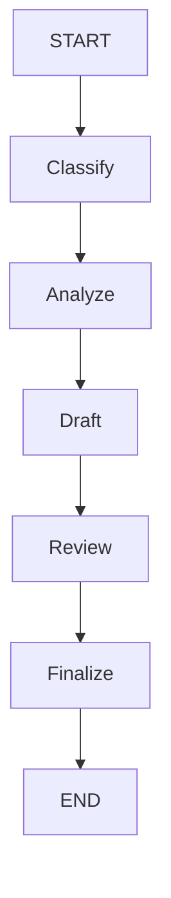

# Part 3 — Example 2: Multiple LLM Nodes and Shared State

Now consider a customer-support application that performs several processing steps.

The application should:

1. Classify the complaint.
2. Analyze the complaint.
3. Draft a response.
4. Review the response.
5. Generate the final response.

## 3.1 Architecture



---

## 3.2 Define the state

```python
class State(TypedDict):
    complaint: str
    category: str
    analysis: str
    draft: str
    review: str
    final_response: str
```

Each node contributes information to this state.

---

## 3.3 Classification node

```python
def classify(state: State):

    prompt = f"""
Classify the following customer complaint.

Possible categories:

PAYMENT
DELIVERY
PRODUCT
ACCOUNT
OTHER

Customer complaint:
{state["complaint"]}

Return only the category.
"""

    response = llm.invoke(prompt)

    return {
        "category": response.content.strip()
    }
```

---

## 3.4 Analysis node

```python
def analyze(state: State):

    prompt = f"""
Analyze this customer complaint.

Complaint:
{state["complaint"]}

Category:
{state["category"]}

Identify:

1. The customer's main problem
2. What the customer wants
3. What action the support team should consider
"""

    response = llm.invoke(prompt)

    return {
        "analysis": response.content
    }
```

The important point is that `analyze()` can use information produced by `classify()`:

```python
state["category"]
```

---

## 3.5 Draft node

```python
def draft_response(state: State):

    prompt = f"""
Write a professional customer-support response.

Customer complaint:
{state["complaint"]}

Category:
{state["category"]}

Analysis:
{state["analysis"]}

Acknowledge the problem and explain the next step.
Avoid unsupported promises.
"""

    response = llm.invoke(prompt)

    return {
        "draft": response.content
    }
```

---

## 3.6 Review node

```python
def review_response(state: State):

    prompt = f"""
Review this customer-support response.

Complaint:
{state["complaint"]}

Draft:
{state["draft"]}

Check whether it:

1. Addresses the problem
2. Is professional
3. Is clear
4. Avoids unsupported promises

Suggest improvements if necessary.
"""

    response = llm.invoke(prompt)

    return {
        "review": response.content
    }
```

---

## 3.7 Finalize node

```python
def finalize(state: State):

    prompt = f"""
Create the final customer-support response.

Complaint:
{state["complaint"]}

Draft:
{state["draft"]}

Review:
{state["review"]}

Apply the reviewer's suggestions.

Return only the final response.
"""

    response = llm.invoke(prompt)

    return {
        "final_response": response.content
    }
```

---

## 3.8 Build the graph

```python
builder = StateGraph(State)

builder.add_node("classify", classify)
builder.add_node("analyze", analyze)
builder.add_node("draft", draft_response)
builder.add_node("review", review_response)
builder.add_node("finalize", finalize)

builder.add_edge(START, "classify")
builder.add_edge("classify", "analyze")
builder.add_edge("analyze", "draft")
builder.add_edge("draft", "review")
builder.add_edge("review", "finalize")
builder.add_edge("finalize", END)

graph = builder.compile()
```

---

## 3.9 Invoke

```python
result = graph.invoke({
    "complaint":
        "I was charged twice for my order.",

    "category": "",
    "analysis": "",
    "draft": "",
    "review": "",
    "final_response": ""
})

print(result["final_response"])
```

---

## 3.10 State evolution

The initial state might be:

```python
{
    "complaint": "I was charged twice for my order.",
    "category": "",
    "analysis": "",
    "draft": "",
    "review": "",
    "final_response": ""
}
```

After `classify`:

```python
{
    "complaint": "...",
    "category": "PAYMENT",
    "analysis": "",
    "draft": "",
    "review": "",
    "final_response": ""
}
```

After `analyze`:

```python
{
    "complaint": "...",
    "category": "PAYMENT",
    "analysis": "The customer appears to have been charged twice...",
    "draft": "",
    "review": "",
    "final_response": ""
}
```

After subsequent nodes, additional fields are populated.

The nodes therefore operate on a **shared application state**.

---
