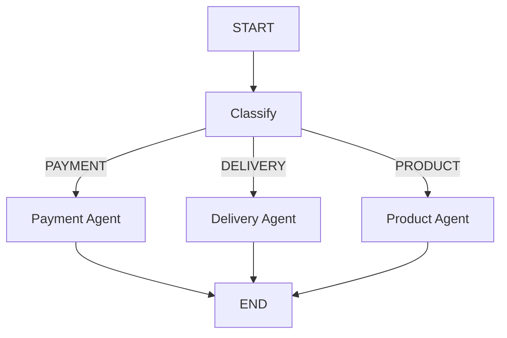
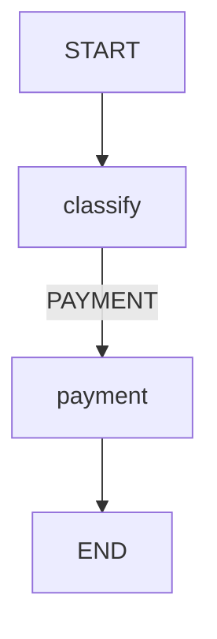
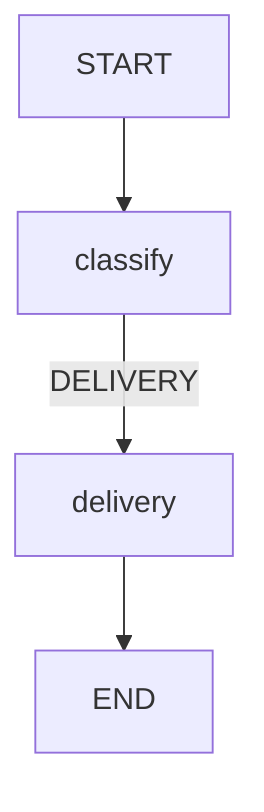

# Part 4 — Example 3: Conditional Routing

A linear sequence is not sufficient for every application.

Suppose different types of customer complaints need different processing.

There are three specialist nodes:

* Payment
* Delivery
* Product

## 4.1 Architecture



---

## 4.2 Specialist nodes

```python
def payment_agent(state: State):

    response = llm.invoke(f"""
You are a payment support specialist.

Customer complaint:
{state["complaint"]}

Provide a helpful response.
""")

    return {
        "response": response.content
    }
```

Delivery:

```python
def delivery_agent(state: State):

    response = llm.invoke(f"""
You are a delivery support specialist.

Customer complaint:
{state["complaint"]}

Provide a helpful response.
""")

    return {
        "response": response.content
    }
```

Product:

```python
def product_agent(state: State):

    response = llm.invoke(f"""
You are a product support specialist.

Customer complaint:
{state["complaint"]}

Provide a helpful response.
""")

    return {
        "response": response.content
    }
```

---

## 4.3 Routing function

```python
def route_complaint(state: State):

    category = state["category"]

    if category == "PAYMENT":
        return "payment"

    elif category == "DELIVERY":
        return "delivery"

    elif category == "PRODUCT":
        return "product"

    else:
        raise ValueError(
            f"Unknown category: {category}"
        )
```

The function returns the identifier of the next node.

---

## 4.4 Conditional edge

```python
builder.add_conditional_edges(
    "classify",
    route_complaint,
    {
        "payment": "payment",
        "delivery": "delivery",
        "product": "product"
    }
)
```

The mapping specifies the relationship between the router's result and the graph's nodes.

```text
"payment"  → payment
"delivery" → delivery
"product"  → product
```

---

## 4.5 Complete graph

```python
builder = StateGraph(State)

builder.add_node("classify", classify)
builder.add_node("payment", payment_agent)
builder.add_node("delivery", delivery_agent)
builder.add_node("product", product_agent)

builder.add_edge(
    START,
    "classify"
)

builder.add_conditional_edges(
    "classify",
    route_complaint,
    {
        "payment": "payment",
        "delivery": "delivery",
        "product": "product"
    }
)

builder.add_edge("payment", END)
builder.add_edge("delivery", END)
builder.add_edge("product", END)

graph = builder.compile()
```

---

## 4.6 Execution

For:

```text
I was charged twice for my order.
```

the category could be `PAYMENT`:



For:

```text
My package has not arrived.
```

the category could be `DELIVERY`:



The LLM determines the category, while the graph's routing logic determines which node executes next.

---
