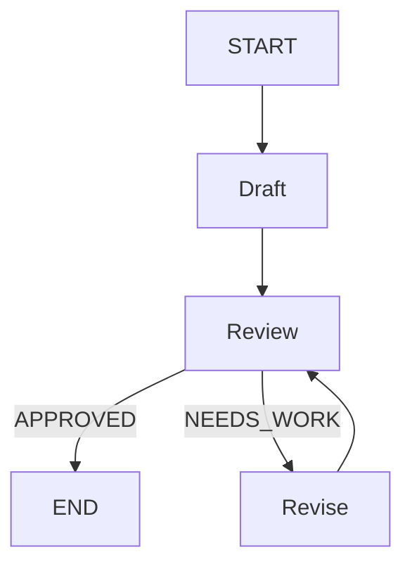
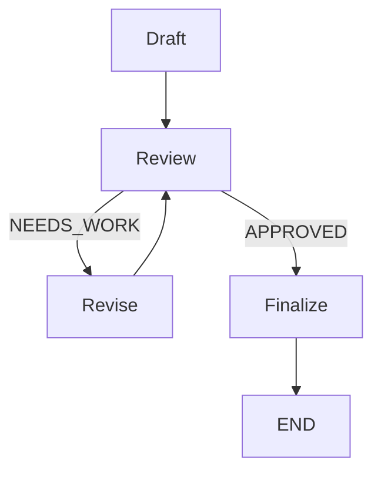

# Part 5 — Example 4: Loops and Iterative Processing

Now consider a response-generation process that requires iterative improvement.

The application should:

1. Generate a response.
2. Review it.
3. Revise it if necessary.
4. Review the revised response.
5. Stop when the response is acceptable.

## 5.1 Architecture



The graph can revisit the `review` node multiple times.

---

## 5.2 State

```python
class State(TypedDict):
    complaint: str
    draft: str
    review: str
    approved: bool
    iteration: int
    final_response: str
```

---

## 5.3 Draft node

```python
def draft_response(state: State):

    response = llm.invoke(f"""
Write a professional customer-support response.

Complaint:
{state["complaint"]}
""")

    return {
        "draft": response.content,
        "iteration": 1
    }
```

---

## 5.4 Review node

```python
def review_response(state: State):

    response = llm.invoke(f"""
Review this customer-support response.

Complaint:
{state["complaint"]}

Draft:
{state["draft"]}

Determine whether the response is acceptable.

Return either:

APPROVED

or:

NEEDS_WORK
followed by feedback.
""")

    review = response.content

    approved = (
        review.strip()
        .upper()
        .startswith("APPROVED")
    )

    return {
        "review": review,
        "approved": approved
    }
```

---

## 5.5 Revision node

```python
def revise_response(state: State):

    response = llm.invoke(f"""
Improve this response.

Complaint:
{state["complaint"]}

Current response:
{state["draft"]}

Review:
{state["review"]}

Return only the revised response.
""")

    return {
        "draft": response.content,
        "iteration": state["iteration"] + 1
    }
```

---

## 5.6 Routing after review

```python
def route_after_review(state: State):

    if state["approved"]:
        return "finalize"

    if state["iteration"] >= 3:
        return "finalize"

    return "revise"
```

The iteration limit is important.

Without a termination condition, an unsuccessful review could result in an indefinitely repeating cycle.

---

## 5.7 Build the graph

```python
builder = StateGraph(State)

builder.add_node("draft", draft_response)
builder.add_node("review", review_response)
builder.add_node("revise", revise_response)
builder.add_node("finalize", finalize)

builder.add_edge(START, "draft")
builder.add_edge("draft", "review")

builder.add_conditional_edges(
    "review",
    route_after_review,
    {
        "finalize": "finalize",
        "revise": "revise"
    }
)

builder.add_edge(
    "revise",
    "review"
)

builder.add_edge(
    "finalize",
    END
)

graph = builder.compile()
```

The critical edge is:

```python
builder.add_edge(
    "revise",
    "review"
)
```

This creates the cycle.

---

## 5.8 Possible execution



A possible execution sequence is:

```text
Draft
  ↓
Review
  ↓
Revise
  ↓
Review
  ↓
Revise
  ↓
Review
  ↓
Finalize
  ↓
END
```

---
