# Part 6 — Example 5: Tool Calling and Agentic Behavior

The next step is to give the LLM access to external capabilities.

Consider this request:

```text
I was charged twice for order ORD123.
Can I get a refund?
```

The LLM does not necessarily know the actual status of `ORD123`.

Instead, it can request information from an order-management system.

The workflow becomes:

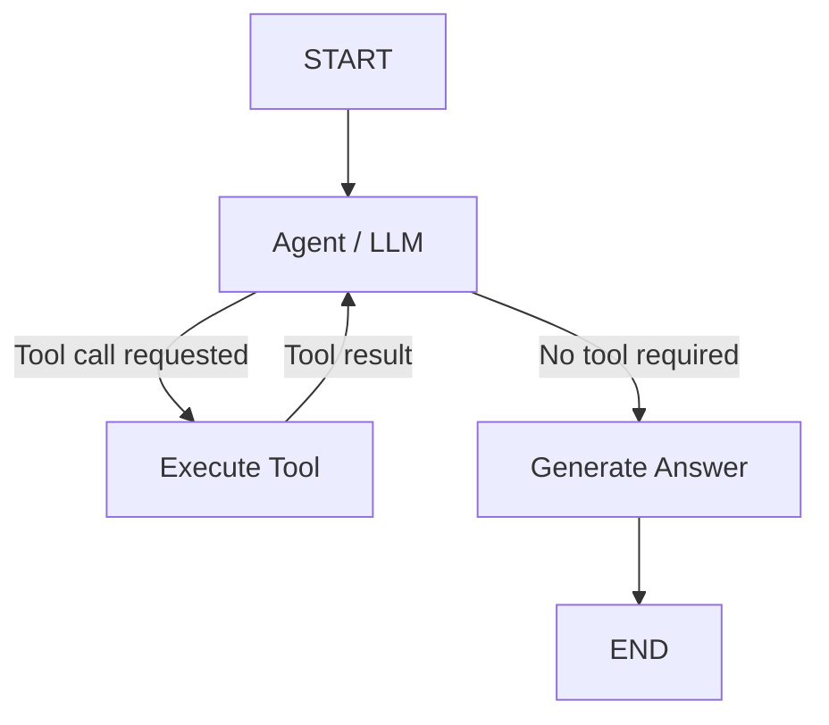

---

## 6.1 Create a tool

```python
from langchain_core.tools import tool

@tool
def get_order_details(order_id: str) -> str:
    """Get order details using the order ID."""

    orders = {
        "ORD123": {
            "status": "DELIVERED",
            "amount": 2500,
            "payment_status": "PAID"
        },
        "ORD456": {
            "status": "SHIPPED",
            "amount": 1800,
            "payment_status": "PAID"
        }
    }

    order = orders.get(order_id)

    if order is None:
        return f"Order {order_id} was not found."

    return str(order)
```

The `@tool` decorator exposes the function as a tool that can be provided to an LLM.

---

## 6.2 Bind the tool to the LLM

```python
llm_with_tools = llm.bind_tools(
    [get_order_details]
)
```

The LLM is now aware that it has access to `get_order_details`.

The LLM does not directly execute the Python function.

Instead, it can produce a tool-call request.

---

## 6.3 State

The state now needs to maintain messages.

```python
class State(TypedDict):
    complaint: str
    messages: list
    response: str
```

---

## 6.4 Agent node

```python
def support_agent(state: State):

    response = llm_with_tools.invoke(
        state["messages"]
    )

    return {
        "messages":
            state["messages"] + [response]
    }
```

For the request:

```text
I was charged twice for order ORD123.
Can I get a refund?
```

the LLM might request:

```python
{
    "name": "get_order_details",
    "args": {
        "order_id": "ORD123"
    }
}
```

This is a tool-call request, not the result of executing the tool.

---

## 6.5 Execute the tool

The application executes the requested tool.

```python
from langchain_core.messages import ToolMessage

def execute_tool(state: State):

    last_message = state["messages"][-1]

    tool_messages = []

    for tool_call in last_message.tool_calls:

        if tool_call["name"] == "get_order_details":

            result = get_order_details.invoke(
                tool_call["args"]
            )

            tool_messages.append(
                ToolMessage(
                    content=str(result),
                    tool_call_id=tool_call["id"]
                )
            )

    return {
        "messages":
            state["messages"] + tool_messages
    }
```

The sequence is:

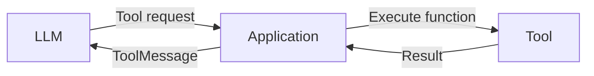

---

## 6.6 Determine whether a tool is required

```python
def route_after_agent(state: State):

    last_message = state["messages"][-1]

    if last_message.tool_calls:
        return "tool"

    return "answer"
```

The conditional routing is:

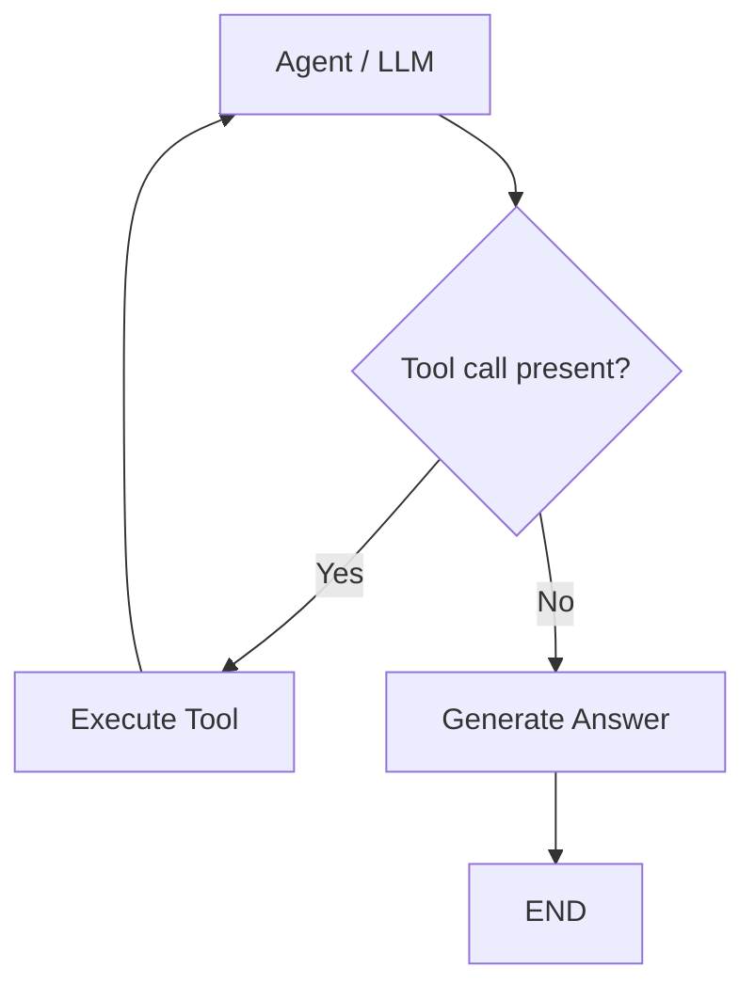

Notice that this introduces a cycle:

```text
Agent → Tool → Agent
```

The LLM can therefore receive the tool result and determine what to do next.

---

## 6.7 Generate the final response

```python
from langchain_core.messages import HumanMessage

def draft_response(state: State):

    prompt = """
Based on the conversation and tool results,
write the final response to the customer.

Do not mention internal tools.

Be concise and professional.
"""

    messages = state["messages"] + [
        HumanMessage(content=prompt)
    ]

    response = llm.invoke(messages)

    return {
        "response": response.content
    }
```

---

## 6.8 Build the graph

```python
builder = StateGraph(State)

builder.add_node(
    "agent",
    support_agent
)

builder.add_node(
    "tool",
    execute_tool
)

builder.add_node(
    "answer",
    draft_response
)

builder.add_edge(
    START,
    "agent"
)

builder.add_conditional_edges(
    "agent",
    route_after_agent,
    {
        "tool": "tool",
        "answer": "answer"
    }
)

builder.add_edge(
    "tool",
    "agent"
)

builder.add_edge(
    "answer",
    END
)

graph = builder.compile()
```

---

## 6.9 Invoke the application

```python
from langchain_core.messages import HumanMessage

result = graph.invoke({

    "complaint":
        "I was charged twice for order ORD123. "
        "Can I get a refund?",

    "messages": [
        HumanMessage(
            content=
            "I was charged twice for order ORD123. "
            "Can I get a refund?"
        )
    ],

    "response": ""
})

print(result["response"])
```

---

## 6.10 Execution sequence

The LLM first receives the customer's request.

It determines that order information is required:

```text
get_order_details("ORD123")
```

The graph routes execution to the tool.

The tool might return:

```text
{
    "status": "DELIVERED",
    "amount": 2500,
    "payment_status": "PAID"
}
```

The result is added to the message history and execution returns to the LLM.

The complete execution is:

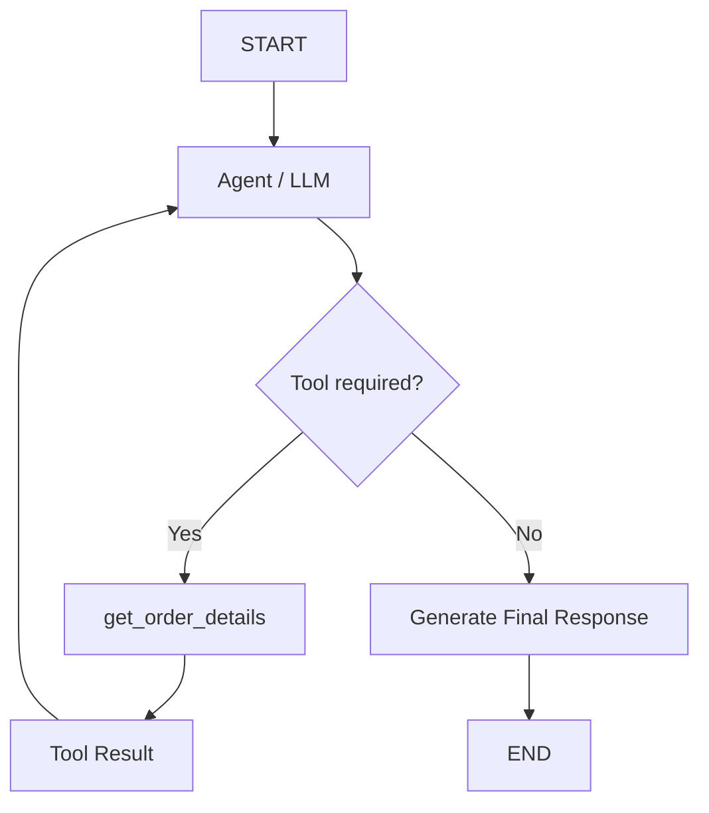

The key concept is that the LLM can participate in an iterative interaction with external capabilities.

---

# LangGraph Core Concepts

At this point, the major building blocks can be summarized as follows.

## Nodes

A node performs an operation.

```python
builder.add_node(
    "classify",
    classify
)
```

A node can contain an LLM, Python logic, a tool, or another operation.

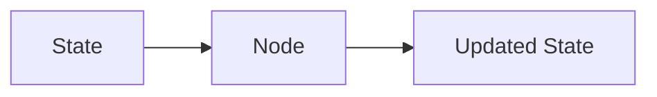

---

## Edges

An edge connects nodes.

```python
builder.add_edge(
    "classify",
    "analyze"
)
```

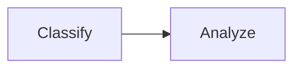

---

## Conditional edges

Conditional edges determine the next node dynamically.

```python
builder.add_conditional_edges(
    "classify",
    route_complaint,
    {
        "payment": "payment",
        "delivery": "delivery",
        "product": "product"
    }
)
```

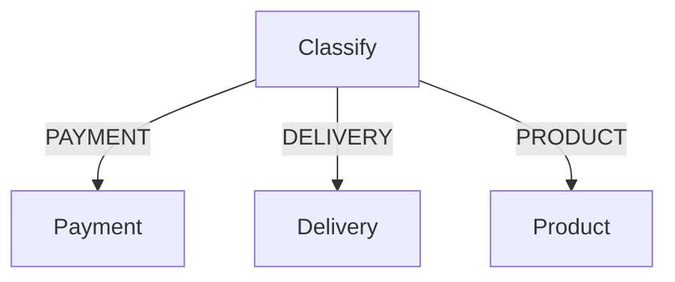

---

## State

State contains information maintained throughout graph execution.

```python
class State(TypedDict):
    complaint: str
    category: str
    response: str
```

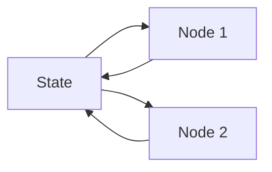

---

## Cycles

A graph can return to an earlier node.

```python
builder.add_edge(
    "revise",
    "review"
)
```

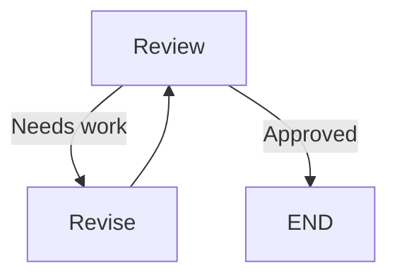

---

## Tools

Tools give an LLM application access to external capabilities.

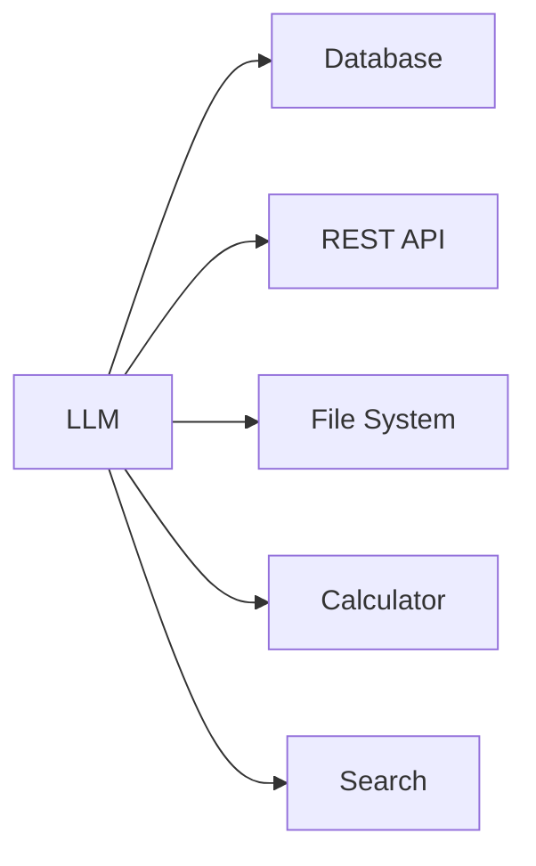

The LLM can request a tool, while the application is responsible for executing it and returning the result.

---

# Putting the Concepts Together

The application has evolved through the following stages:

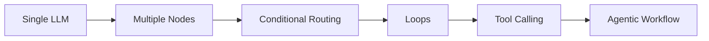

A more complete application might combine all of these concepts:

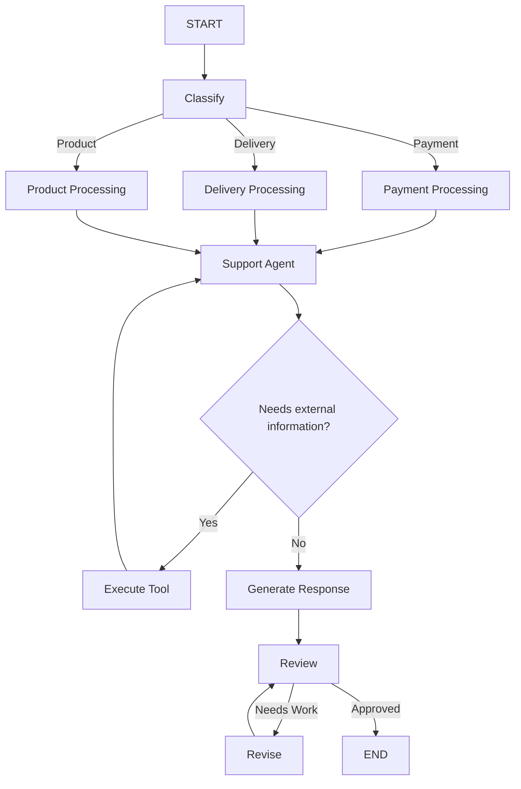

This combines:

* State
* Multiple nodes
* LLM calls
* Conditional routing
* Cycles
* Tool calling
* Iterative processing

These mechanisms form the foundation for larger LangGraph applications such as RAG workflows, tool-using agents, multi-agent systems, approval workflows, and enterprise AI applications.
