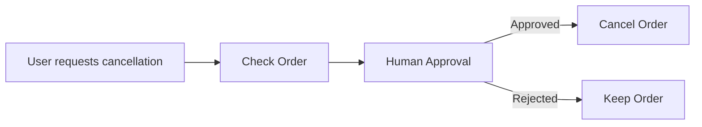

# Challenge: Persistence + Human-in-the-Loop in LangGraph

## Objective

Build a very small LangGraph application that:

1. Maintains conversation state using **persistence**.
2. Pauses execution for **human approval**.
3. Resumes the graph after the human provides a decision.

## Scenario

An order cancellation request should be processed by an agent. Before actually cancelling the order, the workflow pauses and asks a human for approval.

## Flow



## Requirements

Install:

```bash
pip install langgraph langchain-openai python-dotenv
```

## Exercise

Create `human_loop.py`.

Use:

- `StateGraph`
- `InMemorySaver` for persistence
- `interrupt()` for human-in-the-loop
- `Command(resume=...)` to continue execution

The graph should use a `thread_id` so that the workflow state can be persisted between invocations.

## Expected interaction

```text
Order: ORD1001
Status: SHIPPED

Human approval required.
Cancel this order? (yes/no)

> yes

Order ORD1001 has been cancelled.
```

Then demonstrate persistence by invoking the graph again with the **same `thread_id`** and showing that the previous state is available.

## Core Concepts to Demonstrate

| Concept                        | LangGraph API         |
| ------------------------------ | --------------------- |
| State persistence              | `InMemorySaver`       |
| Conversation/workflow identity | `thread_id`           |
| Pause execution                | `interrupt()`         |
| Resume execution               | `Command(resume=...)` |
| Human decision                 | `yes` / `no`          |

## Exercise Task

Implement the graph with **three nodes**:

```text
check_order → request_approval → cancel_order
```

The `request_approval` node should interrupt the graph:

```python
decision = interrupt("Cancel this order?")
```

The application should then resume using:

```python
graph.invoke(
    Command(resume="yes"),
    config=config
)
```

Finally, verify persistence by using the same:

```python
config = {
    "configurable": {
        "thread_id": "order-1001"
    }
}
```

for multiple invocations.

## What to Observe

The important point of the exercise is that **persistence and human-in-the-loop solve different problems**:

- **Persistence** remembers the graph's state and execution checkpoint.
- **Human-in-the-loop** allows execution to pause and wait for an external decision.
- Together, they allow a workflow to stop at an approval point and later continue from exactly that point.
