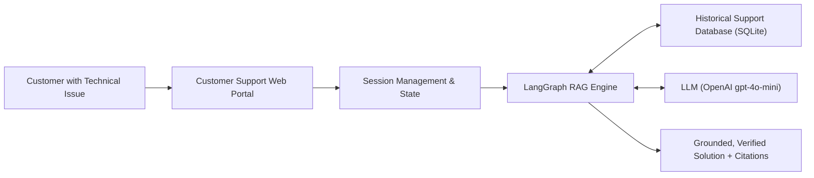
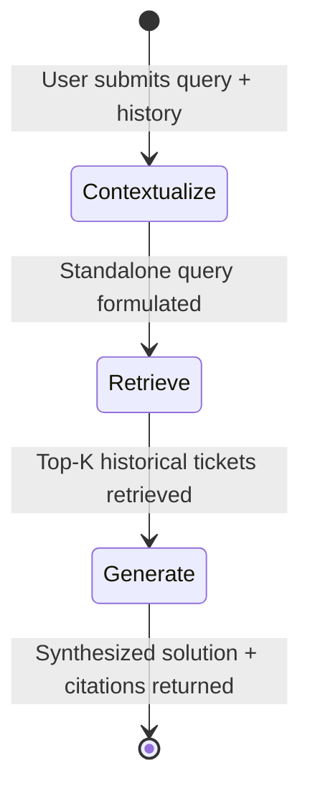
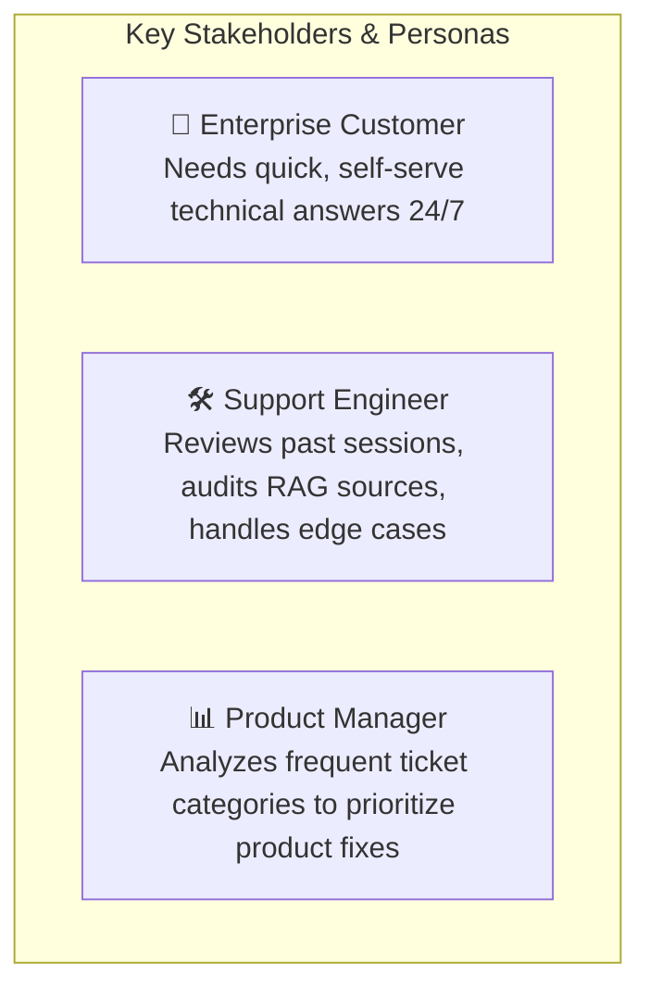

# Problem Statement: Intelligent Multi-Product Customer Support Assistant via Retrieval-Augmented Generation (RAG)

---

## 1. Executive Summary

As enterprise software companies scale their product offerings, the volume and complexity of technical customer inquiries increase exponentially. Traditional customer support models suffer from significant resolution latency, repetitive tier-1 escalations, and inconsistent troubleshooting guidance. 

This project addresses this challenge by designing and building **OmniSupport AI**, a Python Flask-based conversational support platform that leverages **Retrieval-Augmented Generation (RAG)**, **LangChain / LangGraph orchestration**, and **SQLite vector storage** to deliver accurate, contextual, and grounded technical assistance directly from verified historical customer support cases.

---

## 2. Business Context & Background

Our organization develops and maintains a suite of specialized B2B software products:
1. **CloudSync Pro**: Desktop and cloud synchronization platform managing selective sync, file versioning, bandwidth throttling, and end-to-end encrypted storage.
2. **DataPulse Analytics**: Real-time business intelligence and data visualization suite with custom SQL connectors, automated exports, and dashboard caching.
3. **SecureAuth Gateway**: Identity and Access Management (IAM) service supporting SAML 2.0, Okta/Azure AD SSO, WebAuthn/FIDO2 MFA, and SCIM provisioning.
4. **DevFlow CI/CD**: Cloud-native continuous integration and deployment engine executing containerized pipelines, secrets management, and automated rollbacks.

Over years of production usage, the customer support engineering team has diagnosed, solved, and documented thousands of technical incidents. However, this repository of verified solutions remains **siloed in historical ticket databases**, requiring manual lookup by support agents and causing prolonged customer wait times.

---

## 3. The Core Problem

### 3.1. Primary Problem Statement
> **How might we enable customers across distinct software products to receive instant, accurate, and context-aware resolutions to technical problems by dynamically retrieving and synthesizing historical support data, while maintaining strict conversation session boundaries and auditable conversation history?**

### 3.2. Detailed Pain Points & Key Challenges

#### A. Resolution Latency & Tier-1 Escalation Overhead
- Support engineers spend up to 40% of their time answering repeat inquiries (e.g., macOS permission locks, SSL certificate chains, SAML Audience URI mismatches, Docker runner permissions).
- Customers experience frustrating delays (hours to days) for issues that already have well-documented fixes in past tickets.

#### B. The LLM Hallucination & Domain Specificity Risk
- Pure, ungrounded Large Language Models (LLMs) frequently hallucinate non-existent configuration flags, outdated CLI parameters, or generic advice that fails in production environments.
- Support solutions must adhere strictly to verified institutional procedures and cite specific historical reference tickets.

#### C. Cross-Product Ambiguity & Context Bleed
- Different software products have overlapping terminology (e.g., "sync", "token", "caching", "runner") that mean drastically different things depending on whether the customer is using CloudSync Pro or DevFlow CI/CD.
- The system must enforce strict product boundaries during knowledge retrieval to eliminate cross-product confusion.

#### D. Conversational Session Lifecycle & State Isolation
- Real customer troubleshooting is rarely solved in a single prompt. It involves **multi-turn dialogues** where customers ask follow-up questions (e.g., *"Where do I find that lock file?"* or *"What if my branch is staging instead of main?"*).
- The solution must maintain a cohesive session state, formulate contextual search queries across turns, support deliberate session termination, and prevent data leakage between different customer interactions.

#### E. Lack of Transparency & Auditability
- Customers and support supervisors need to inspect *why* an AI provided a specific recommendation.
- The system must provide transparent citation of historical ticket IDs, resolution summaries, and semantic similarity scores.

---

## 4. Project Objectives & Scope

### 4.1. Core Objectives
1. **Knowledge Base Grounding**: Ingest historical customer support data (customer query, support response, resolution summary, category) and index it with high-dimensional vector embeddings for low-latency retrieval.
2. **Customer Onboarding & Product Scoping**: Provide an intuitive web interface capturing customer credentials (Name, Email) and target software product to scope the session.
3. **Conversational RAG State Machine**: Implement a robust LangGraph pipeline that contextualizes follow-ups, retrieves product-specific historical cases, and generates empathetic, step-by-step technical guides.
4. **Strict Session Lifecycle**:
   - **Start**: Customer initiates a session, assigns a unique UUID, and registers user metadata.
   - **Active**: Customer engages in multi-turn troubleshooting with persistent history.
   - **End**: Customer or system concludes the session, updating database status to `ended` and disabling further input.
5. **Observability & Analytics**: Integrate Langfuse instrumentation to monitor latency, trace LLM calls, and evaluate retrieval effectiveness.

### 4.2. In-Scope vs. Out-of-Scope

| In-Scope | Out-of-Scope (Future Enhancements) |
|---|---|
| Ingestion & embedding of multi-product historical tickets | Automated bi-directional sync with Zendesk/Jira APIs |
| Product-scoped vector similarity + lexical hybrid search | Voice/audio phone call transcription |
| Multi-turn conversation history persistence in SQLite | Automated execution of remote shell commands on user machines |
| Session start, active messaging, and clean session termination | Payment gateway integration / billing checkout |
| In-browser transcript export and historical ticket explorer | Autonomous agent actions outside the support domain |

---

## 5. Architectural & Functional Requirements

### 5.1. Functional Requirements Matrix

| ID | Requirement | Description |
|---|---|---|
| **FR-01** | **Historical Support DB** | Relational & vector-enabled database storing ticket codes, products, categories, customer queries, and verified solutions. |
| **FR-02** | **Customer Intake Form** | Web UI form capturing Customer Name, Email, Product dropdown, and optional initial query. |
| **FR-03** | **Product Sample Prompts** | Dynamic prompt chips for selected products to facilitate rapid testing and user guidance. |
| **FR-04** | **Conversational RAG** | Multi-stage pipeline: Query contextualization -> Vector retrieval -> Grounded solution generation. |
| **FR-05** | **Session Isolation** | Unique `session_id` per conversation; state and messages are strictly partitioned. |
| **FR-06** | **Session Termination** | Dedicated "End Conversation" action that marks the session as closed and locks further input. |
| **FR-07** | **History Persistence** | Chronological message storage with RAG sources retained for auditability and transcript downloads. |
| **FR-08** | **Source Transparency** | Expandable UI component detailing retrieved historical tickets, relevance percentage, and resolution summary. |
| **FR-09** | **Past Sessions Viewer** | Modal allowing users or managers to review past sessions, message counts, and timestamps. |

### 5.2. LangGraph State Machine Workflow

1. **Contextualize Node**: Uses `gpt-4o-mini` to transform follow-up questions containing pronouns or ambiguous references into an explicit, product-aware search query.
2. **Retrieve Node**: Filters database candidates by `product`, performs cosine similarity using `text-embedding-3-small`, applies lexical boost, and ranks top 3 relevant tickets.
3. **Generate Node**: Prompts the LLM with customer identity, system guidelines, verified historical context, and previous dialogue history to output a polite, step-by-step markdown response with citations (`[Ref: CODE]`).

---

## 6. Success Metrics & Key Performance Indicators (KPIs)

| Metric | Target | Measurement Method |
|---|---|---|
| **Retrieval Relevance (Hit@3)** | $\ge 90\%$ | Proportion of queries where the top 3 retrieved tickets contain the correct resolution. |
| **Groundedness / Hallucination Rate** | $< 2\%$ | Human audit verifying that instructions match verified historical resolutions. |
| **First Contact Resolution (FCR)** | $\ge 65\%$ | Percentage of customer issues resolved within a single active session without escalation. |
| **P95 Response Latency** | $< 3.5\text{s}$ | End-to-end latency from user input submission to response stream completion (tracked in Langfuse). |
| **Session State Integrity** | $100\%$ | Zero data leakage between distinct customer session IDs. |

---

## 7. Target User Personas

1. **Enterprise Customer**: Needs immediate, reliable answers to software errors without filing a ticket and waiting 24-48 hours.
2. **Support Engineering Lead**: Wants to reduce tier-1 burden, ensure consistent answers, and audit AI responses against verified organizational policies.
3. **Product Manager**: Reviews common failure modes and support transcripts to identify software usability issues and drive product improvements.

---

## 8. Conclusion & Expected Impact

Implementing this RAG-driven customer support architecture transforms unstructured organizational support history into an active, intelligent, 24/7 problem-solving engine. By enforcing product isolation, multi-turn conversational context, and explicit session lifecycle controls, the solution eliminates hallucinations and empowers customers with verified technical solutions in seconds.
